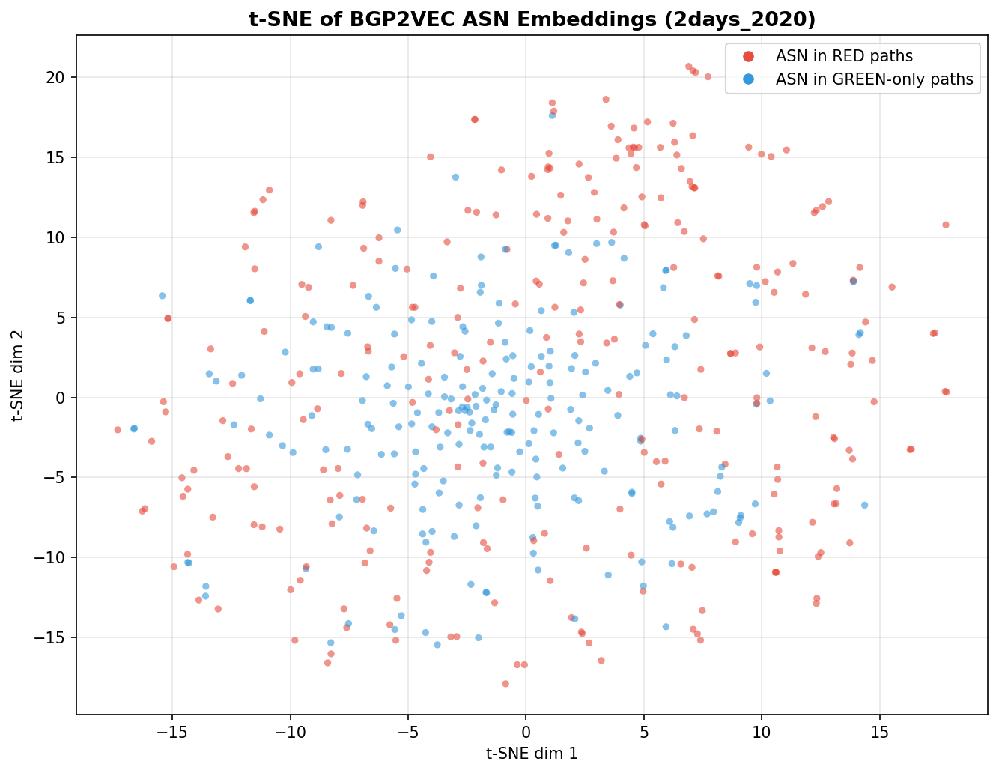
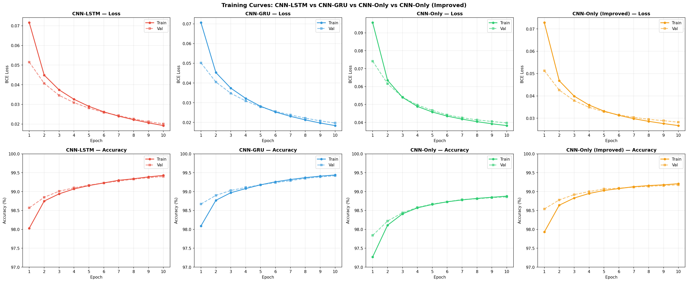
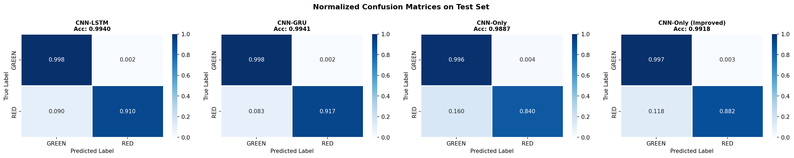
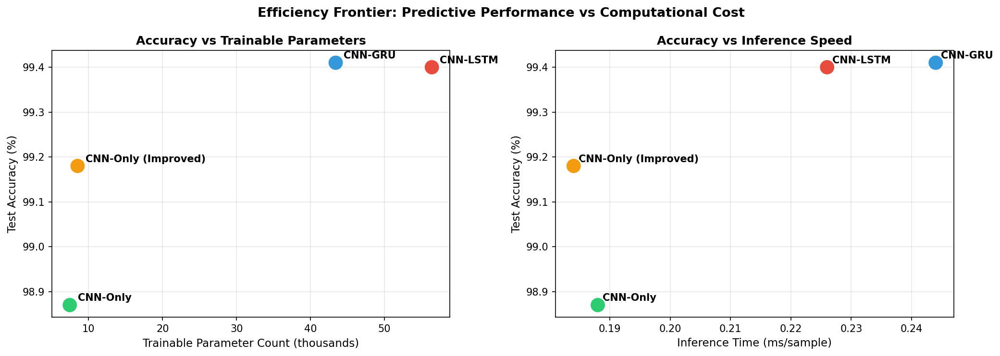
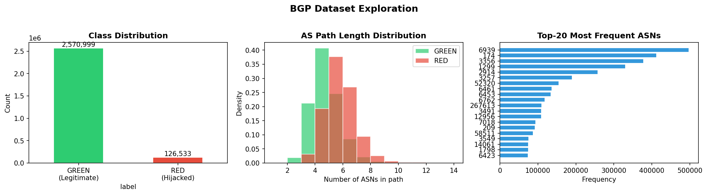

# Lightweight-Neural-Models-for-BGP-Hijack-Detection

This project investigates lightweight neural architectures for detecting BGP prefix hijacking using AS-path data. Starting from an existing CNN-LSTM baseline with ASN embeddings, we explore whether simpler models such as CNN-only and CNN-GRU can achieve comparable detection performance with lower computational complexity.

This repository contains a TensorFlow/Keras-based classifier for detecting BGP hijacking events from AS path data. The model uses pre-trained BGP2Vec embeddings to represent AS numbers and supports three neural network architectures:

- **CNN-LSTM** — Embedding → Conv1D → MaxPool → LSTM(100) → Dense
- **CNN-GRU** — Embedding → Conv1D → MaxPool → GRU(100) → Dense
- **CNN-Only** — Embedding → Conv1D → MaxPool → GlobalMaxPool → Dense(128) → Dense
- **CNN-Only (Improved)** — A refined CNN-Only variant with two Conv1D layers, BatchNorm, and a smaller Dense(64) head

The script reads labeled BGP paths, converts each AS path into a sequence of BGP2Vec embedding indices, trains a binary classifier, evaluates the model, and saves the trained model.

---

## File

### `lstm_hijack_classifier.py`

## Arguments

| Argument | Description |
|---|---|
| `bgp2vec_model` | Path to the trained BGP2Vec model |
| `labeled_paths_file` | Path to the labeled AS path dataset |
| `output_model` | Path where the trained Keras model will be saved |
| `model_selection` | Model architecture selection: `0` for CNN-LSTM, `1` for CNN-GRU, `2` for CNN-Only |

## Usage

python3 lstm_hijack_classifier.py <bgp2vec_model> <labeled_paths_file> <output_model> <model_selection>

## Example

python3 lstm_hijack_classifier.py bgp2vec/2days_2020.b2v classified/2days_2020.vf lstm/2days_2020.keras 0

### `bgp_hijack_detection_real_data.ipynb` and `final.pdf` — PyTorch Exploration Notebook

This Jupyter notebook is a standalone, end-to-end PyTorch implementation of the same research question. It is structured as a reproducible research log covering the full pipeline from raw data to analysis, and is intended to be run sequentially on the real `2days_2020` dataset files.

**Sections:**

- **0. Environment Setup** — installs dependencies (PyTorch, gensim, scikit-learn, seaborn) and sets global seeds for reproducibility.
- **1. Data Loading & Preprocessing** — parses `2days_2020.vf` into a labeled DataFrame (GREEN/RED), performs stratified train/test split, and runs exploratory data analysis including class distribution, AS path length histograms, and top-ASN frequency plots.
- **2. ASN Embedding (BGP2VEC)** — loads the pre-trained `2days_2020.b2v` Word2Vec model (or trains from `.paths` as fallback), builds the embedding matrix, and optionally renders a t-SNE visualization of the ASN embedding space.
- **3. Dataset & DataLoader** — encodes AS paths as padded integer index sequences and wraps them in PyTorch `Dataset`/`DataLoader` objects.
- **4. Model Definitions** — defines a shared `BGPEncoder` front-end (embedding + Conv1D + MaxPool) in PyTorch `nn.Module`, then three classifier heads: `CNN-LSTM`, `CNN-GRU`, and `CNN-Only`.
- **5. Training Loop** — uses `BCEWithLogitsLoss` with `pos_weight ≈ 20.3` to handle class imbalance (1,799,698 legitimate vs 88,573 hijacked in training). Trains each model for 5 epochs, logging train/val loss, accuracy, and AUC per epoch.
- **6. Results & Comparison** — produces a summary table, training curves (3×3 grid of loss and accuracy plots), normalized confusion matrices, overlaid ROC curves, and an efficiency frontier scatter plot.
- **7. Analysis & Discussion** — quantifies the relative accuracy, parameter count, and inference speed of each model vs. the CNN-LSTM baseline.
- **9. Conclusions** — answers the research question: full recurrent sequence modeling is not necessary. On this dataset, CNN-Only slightly outperformed both recurrent models while being 32–38% faster at inference.

## Dataset

The experiments use the `2days_2020.vf` labeled dataset from the [bgphijack repo](https://github.com/bgphijack/bgphijack) (Shapira & Shavitt, 2020). It contains **2,697,532 AS paths** labeled as either legitimate (GREEN) or hijacked (RED).

| Class | Count | Share |
|---|---|---|
| GREEN (Legitimate) | 2,570,999 | 95.31% |
| RED (Hijacked) | 126,533 | 4.69% |

The dataset is highly imbalanced, which makes recall on the hijacked class a meaningful evaluation metric alongside overall accuracy.

Average AS path length is **4.3 hops** for legitimate routes and **5.3 hops** for hijacked routes, suggesting hijacked paths tend to be slightly longer — consistent with route injection through extra ASes.

---

## ASN Embeddings (BGP2Vec)

Each AS number is represented as a 32-dimensional dense vector using a pre-trained **BGP2Vec** model (`2days_2020.b2v`). BGP2Vec applies a Word2Vec skip-gram approach to AS paths, treating each path as a sentence and each AS number as a word. This gives every ASN a latent vector that captures its routing relationships.

The vocabulary covers **63,005 unique ASNs**. A zero-padded embedding matrix is constructed so that the padding token (index 0) maps to an all-zeros vector. Embeddings are **frozen** during classifier training, matching the original paper's design.

### Figure: t-SNE of BGP2VEC ASN Embeddings

This plot shows a 2D t-SNE projection of a sample of ASN embeddings, colored by whether the ASN appears in hijacked (RED) paths or legitimate-only (GREEN) paths. The lack of clean cluster separation indicates that ASN identity alone is not sufficient to distinguish hijacked from legitimate routes — the sequential structure of the path matters, motivating the use of sequence models over the embeddings.

---

## Model Architectures

All four models share the same frozen BGP2Vec embedding layer, a Conv1D(32, k=3, ReLU, padding='same') followed by MaxPooling1D(2), and are trained with Adam(lr=0.0001), binary cross-entropy loss, batch size 64, for 10 epochs.

| Model | Additional layers | Total Params | Trainable Params |
|---|---|---|---|
| CNN-LSTM | LSTM(100) → Dense(1) | 2,072,597 | 56,405 |
| CNN-GRU | GRU(100) → Dense(1) | 2,059,597 | 43,405 |
| CNN-Only | GlobalMaxPool → Dense(128) → Dense(1) | 2,023,649 | 7,457 |
| CNN-Only (Improved) | 2×[Conv1D+BN] → GlobalMaxPool → Dense(64) → Dense(1) | 2,024,833 | 8,513 |

The vast majority of parameters in every model are the frozen embedding weights (~2.02M). The trainable parameter count reveals the true complexity of each classifier head.

---

## Results

### Final Model Comparison

| Model | Accuracy | Tot. Params | Trainable | T/epoch | Inference |
|---|---|---|---|---|---|
| CNN-LSTM | 99.40% | 2,072,597 | 56,405 | 434s | 0.226ms |
| CNN-GRU | 99.42% | 2,059,597 | 43,405 | 503s | 0.242ms |
| CNN-Only | 98.86% | 2,023,649 | 7,457 | 139s | 0.188ms |
| CNN-Only (Improved) | 99.18% | 2,024,833 | 8,513 | 223s | 0.184ms |

The key finding is that **CNN-GRU matches or slightly outperforms CNN-LSTM** across both accuracy and AUC while training ~13% faster per epoch. The **CNN-Only (Improved)** model — which adds a second convolutional block and batch normalization — closes most of the gap to the recurrent models while remaining over 2× faster to train and achieving the fastest inference time (0.184ms/sample).

### Figure: Training Curves

Loss and accuracy curves over 10 epochs for all four models (train = solid, validation = dashed). All models converge cleanly with no signs of overfitting — train and validation curves track closely throughout. The recurrent models (CNN-LSTM, CNN-GRU) start with lower initial accuracy but converge to higher final values. CNN-Only (Improved) catches up significantly compared to the original CNN-Only, demonstrating that a second convolutional block with batch normalization recovers most of the recurrent model's advantage.

### Figure: Normalized Confusion Matrices

Normalized confusion matrices on the held-out test set (20% of 2.7M samples). All models achieve near-perfect recall on the GREEN (legitimate) class. The key differentiator is **recall on the RED (hijacked) class**:

- CNN-LSTM: 91.0% hijack recall (9.0% miss rate)
- CNN-GRU: 91.7% hijack recall (8.3% miss rate)
- CNN-Only: 84.0% hijack recall (16.0% miss rate)
- CNN-Only (Improved): 88.2% hijack recall (11.8% miss rate)

False negatives (missed hijacks) are more costly than false positives in a security context, making hijack recall an especially important metric. The GRU model achieves the best hijack recall, and the improved CNN-Only closes much of the gap over the original.

### Figure: Efficiency Frontier

Two scatter plots comparing models on accuracy vs. model size (left) and accuracy vs. inference speed (right). The plots highlight the efficiency tradeoff:

- **CNN-LSTM and CNN-GRU** dominate in accuracy but use the most trainable parameters and are slowest to infer.
- **CNN-Only** has the fewest trainable parameters but the weakest accuracy, sitting at the lower-left of both plots.
- **CNN-Only (Improved)** occupies the middle of the frontier — slightly larger and slower than the original CNN-Only, but substantially more accurate, making it the best choice when recurrent layers are undesirable (e.g., on-device or real-time deployments with strict latency budgets).

### Figure: Dataset Exploration (EDA)

Three panels summarizing the dataset:

1. **Class Distribution** — Bar chart confirming the strong class imbalance (~95% GREEN, ~5% RED).
2. **AS Path Length Distribution** — Density histogram by class. Hijacked paths (RED) are right-shifted relative to legitimate paths (GREEN), with a mode around 5–6 hops vs. 4 hops. This validates path length as a weak but non-zero signal.
3. **Top-20 Most Frequent ASNs** — Horizontal bar chart of the most common ASNs by occurrence in the dataset. A handful of large transit ASes dominate traffic volume, consistent with the real-world structure of the internet's AS graph.

---

## Key Takeaways

1. **Recurrent layers help but are not essential.** CNN-GRU and CNN-LSTM achieve the highest hijack recall (~91–92%), but the gap to a well-tuned CNN-only model narrows considerably with two convolutional blocks and batch normalization.
2. **GRU is a better recurrent choice than LSTM** for this task — it matches or beats LSTM accuracy with fewer parameters and faster training.
3. **CNN-Only (Improved) is the efficiency sweet spot** for deployment contexts: it trains 2× faster than the recurrent models, achieves the lowest inference latency, and reaches 99.18% accuracy with only 8,513 trainable parameters.
4. **BGP2Vec embeddings carry most of the signal.** The frozen embedding layer (>2M parameters) does the heavy lifting; the classifier head needs only a few thousand trainable weights to achieve strong performance.

---

## References

- Shapira, T., & Shavitt, Y. (2020). *Flowpic: Encrypted Internet Traffic Classification is Easy as Identifying Faces in the Wild*. NetAI'20. ([bgphijack repo](https://github.com/bgphijack/bgphijack))
- Mikolov, T. et al. (2013). *Distributed Representations of Words and Phrases and their Compositionality*. NeurIPS.
